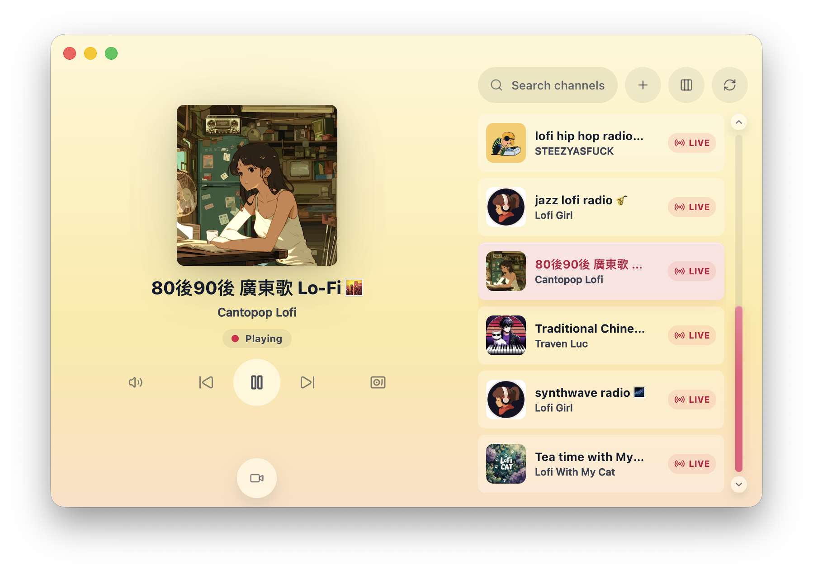
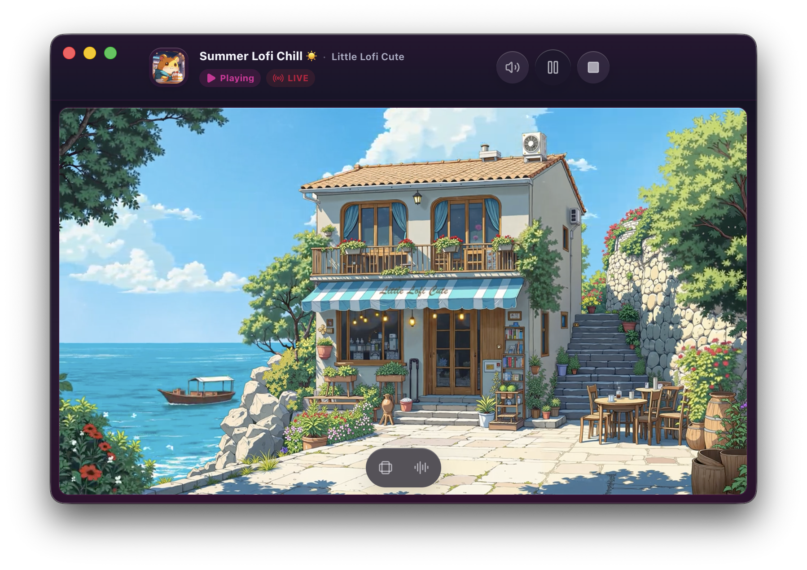
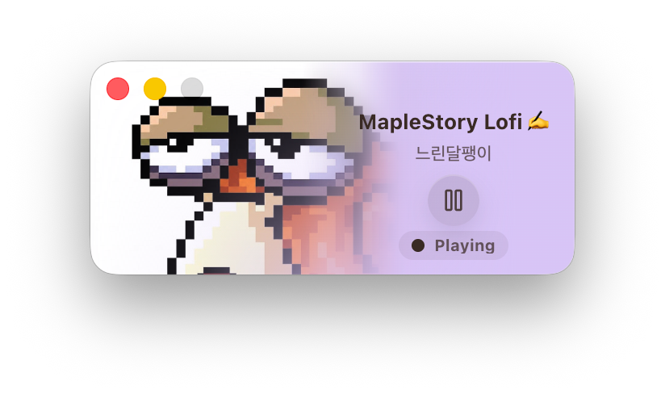

  
  <h1>放空</h1>
  
<strong>一款可自定义频道的 Lo-Fi 直播桌面播放器</strong>

  

    <a href="./README.md">English</a> ·
    <strong>简体中文</strong>
  

  

    
    
    
    
  

## 项目简介

放空是一款围绕 YouTube Live Lo-Fi 频道打造的轻量桌面播放器。它会直接打开到专注的播放界面，内置放空推荐频道列表，也支持把正在直播或预定直播的 YouTube Live 加入自己的频道分组。

放空源自 [XiaDown](https://github.com/arnoldhao/xiadown) 的在线音乐直播模块。如果你需要一款支持在线音乐的视频下载工具，XiaDown 不仅内置 YouTube Lo-Fi 电台与 YouTube Music，还支持上千个在线视频网站的素材下载、转码和资源管理。

## 主要能力

- **三种播放形态**：提供迷你播放器、音频模式和视频模式，适配不同桌面空间与使用习惯。
- **内置推荐与自定义频道**：可直接播放放空推荐列表，也可以刷新列表、添加自己喜欢的正在直播或预定直播的 YouTube Live 频道，并自定义标题和分组。
- **简约且可调的外观**：界面克制清爽，支持浅色、深色、跟随系统、多套主题包、自定义强调色、字体选项、代理设置，以及托盘或菜单栏行为。

## 产品界面

  

  

  

## 快速开始

### 下载安装

下载地址会在发布构建可用后补充到下表；历史版本可见 [GitHub 发布页](https://github.com/arnoldhao/hush/releases)。

| 平台    | 架构      | 形式   | 下载 |
| ------- | --------- | ------ | ---- |
| macOS   | Universal | 压缩包 |      |
| Windows | x64       | 安装版 |      |
| Windows | x64       | 便携版 |      |

### 首次打开

1. `macOS`：解压后将 `Hush.app` 移动到“应用程序”目录。若系统提示“无法打开”或“已损坏”，请在终端执行 `sudo xattr -rd com.apple.quarantine /Applications/Hush.app`。
2. `Windows`：安装版直接运行 `.exe`；便携版解压后直接启动。若首次启动出现 SmartScreen，选择“更多信息 -> 仍要运行”。
3. 放空首次启动会默认进入直播播放器。你可以在设置中完成语言、外观、代理、菜单栏或托盘行为和更新偏好配置，然后从内置频道开始播放，或添加自己的 YouTube Live 链接。

## 感谢

放空建立在一系列优秀的开源项目和服务之上。桌面体验、直播播放、本地存储、更新能力与前端界面，都离不开这些基础能力的支持。

| 分类       | 项目主页                                                                                                                                                                                                                                                                                                |
| ---------- | ------------------------------------------------------------------------------------------------------------------------------------------------------------------------------------------------------------------------------------------------------------------------------------------------------- |
| 桌面框架   | <a href="https://www.electronjs.org/" target="_blank" rel="noreferrer">Electron</a> / <a href="https://react.dev/" target="_blank" rel="noreferrer">React</a>                                                                                                                                           |
| 直播播放   | <a href="https://www.youtube.com/live" target="_blank" rel="noreferrer">YouTube Live</a> / <a href="https://developers.google.com/youtube/iframe_api_reference" target="_blank" rel="noreferrer">YouTube IFrame Player API</a>                                                                          |
| 本地存储   | <a href="https://www.sqlite.org/" target="_blank" rel="noreferrer">SQLite</a> / <a href="https://github.com/WiseLibs/better-sqlite3" target="_blank" rel="noreferrer">better-sqlite3</a> / <a href="https://github.com/sindresorhus/electron-store" target="_blank" rel="noreferrer">electron-store</a> |
| 构建与更新 | <a href="https://electron-vite.org/" target="_blank" rel="noreferrer">electron-vite</a> / <a href="https://www.electron.build/" target="_blank" rel="noreferrer">electron-builder</a> / <a href="https://www.electron.build/auto-update" target="_blank" rel="noreferrer">electron-updater</a>          |
| 前端体验   | <a href="https://vite.dev/" target="_blank" rel="noreferrer">Vite</a> / <a href="https://www.typescriptlang.org/" target="_blank" rel="noreferrer">TypeScript</a> / <a href="https://lucide.dev/" target="_blank" rel="noreferrer">Lucide</a>                                                           |

## 协作

- 项目正在持续演进，当前暂不接受 PR，欢迎通过 [GitHub Issues](https://github.com/arnoldhao/hush/issues) 或邮件反馈问题、分享建议与使用场景。
- 仓库采用 `Apache-2.0` 许可证，详见 [LICENSE](./LICENSE)。

## 联系

- 官网：<https://dreamapp.cc/>
- 邮箱：<xunruhao@gmail.com>
